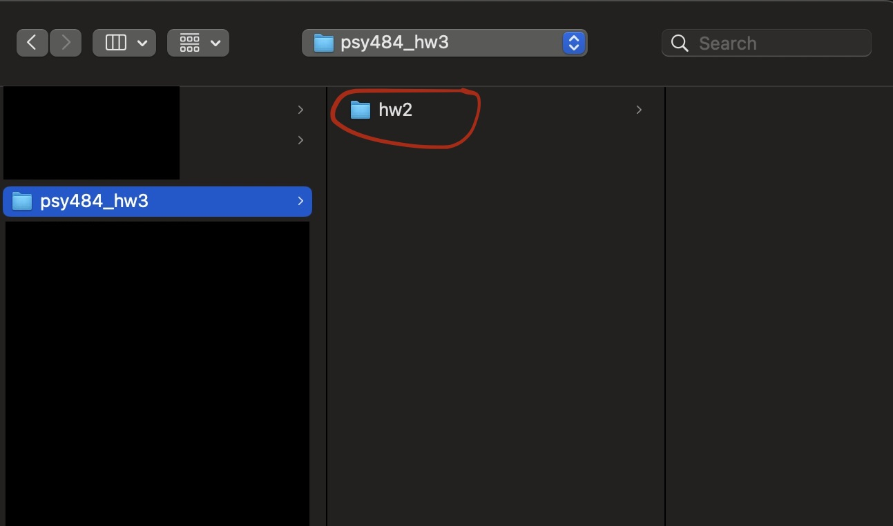

#### Step 1: Initializing GitHub

1. Go to the repository link: [https://github.com/emanp/PSY484-Final-Project](https://github.com/emanp/PSY484-Final-Project)

2. Click the green 'code' icon:

   

3. Copy the link: 

   

   

4. In GitHub Desktop, click File -> Clone Repository: 

   

   

5. A window will open. Navigate to 'URL' and enter the URL you copied in step 3 and choose where you want to save the project. 

   

   

6. Congrats! You have successfully cloned a repository. 

   

7. On the top-right, click 'Fetch Origin':

   

   

8. Go to where you saved the project. In my case, I saved it in Desktop:

   

   **If it's there, you are all done**!

   

#### Step 2: Accessing the project from Unity

1. Open Unity Hub

2. Click Add -> Add Project From Disk. Click on the psy484_hw3 you just saved and click on the 'hw2' folder inside of it. This is the folder containing the project. : 

   

   

3. You should now see the project in Unity Hub: 

   

   

4. Click on the project to open it. After a bit of loading, a new window should appear: 

   

**Congrats! You are all set to develop in Unity.**

#### Step 3: Adding our changes 

Your teammates need your changes! Let's add them to GitHub so your teammates can access them.

1. Now let's make a change! In this example, all I did was add a simple text file. 

2. Go back to GitHub Desktop. You should see the new file appear: 

   

   

3. In the bottom left, click on the text box and type a few words about what  you added/did, and add a description if desired. (ex. "Added controller walking functionality")

4. Click "Commit": 

   

   

5. We are not done yet! We need to upload, or 'Push' these changes to GitHub. To do this, go to the upper right and press 'Push Origin': 

   

   

6. All done! Go back to the repository link and refresh. You should now see what you added:

   

   

**Note: Do this after every feature you implement, but let your teammates know first to avoid problems. **

**Note 2: Ideally, one would not push to 'main' all the time. But for now, since we are working in sequential order, and it is a small project, we are okay with pushing to 'main.' In the future, we will go over something called 'branches' which should resolve most issues. **

#### Important: Accessing changes someone else has added

You also need your teammate's changes! Let's download, or 'pull' them.

1. Go to GitHub Desktop and click 'fetch origin':

   

2. That same button should change to 'pull origin'. Click it again. 

3. Wait for a bit while your project gets updated to include the incoming changes. 

**All done! Open the project in Unity and you should see the changes that were made.**

#### Helpful tips: 

- Always 'pull' before starting to work on something!

- Communicate! 

 

